## What new java 9 - 17:
- 9
   * Interface private method
   * CompletableFuture API improvement
   * Stream API improvement: Take while,  Drop while, Iterate,  Of nullable
   * Collection factory
   * Java Module system
- 10: Var
- 11, 12
   * 11. String API improvement: isBlank(), repeat(), strip(), lines()
   * 12. String API improvement: indent(), transform()
- 14: Switch expression, NullPointerException
- 15: Text block
- 16: Pattern matching for instanceof
```java
Object object = "";
if (object instanceof String string) {
   System.out.println(string);
}
```
Record type
```java
public record Person(String fullName, String address) {

    public Person() {
        this("defaultValue", "defaultValue");
    }
}
```
17: Sealed class: tăng tính encapsulation
```java
sealed interface Runnable permits Dog {

    void run();
}
final class Dog implements Runnable {
    @Override
    public void run() {
    }
}
```


## What new java 8:
### [1. Default method và static method](https://gpcoder.com/3854-interface-trong-java-8-default-method-va-static-method/)
- Default và static

### [2. Lambda Expressions](https://gpcoder.com/3898-bieu-thuc-lambda-trong-java-8-lambda-expressions/)
- Lambda Expression (biểu thức Lambda) có thể được định nghĩa là một hàm ẩn danh, cho phép người dùng chuyển các phương thức làm đối số. Điều này giúp loại bỏ rất nhiều mã soạn sẵn.

- Lambda Expression là một hàm không có tên và không thuộc bất kỳ lớp nào, không có phạm vi truy cập (private, public hoặc protected), không khai báo kiểu trả về.
- Biểu thức Lambda trong java gồm có 3 thành phần sau:

    * **Argument-list**: có thể không có, có một hoặc nhiều tham số
    * **Arrow-token**: được sử dụng để liên kết arguments-list và body của biểu thức.
    * **Body**: chứa các biểu thức và câu lệnh cho biểu thức lambda.
- Functional interface:
    * Predicate (Thường thấy khi dùng filter) -> boolean test(T t); (or, and, negate)
    * Consumer (Thường thấy ở foreach) -> void accept(T t); (andThen)
    * Supplier (Thường thấy ở orElseGet) -> T get();
    * Function (Thường thấy trong map) -> R apply(T t);
### [3. Method References](https://gpcoder.com/3882-phuong-thuc-tham-chieu-trong-java-8-method-references/)
- Cách dùng
   * Tham chiếu đến 1 static method
   * Tham chiếu đến một instance method của một đối tượng cụ thể
   * Tham chiếu đến một instance method của một đối tượng tùy ý của một kiểu cụ thể
   * Tham chiếu đến một constuctor

### [4. Stream API](https://gpcoder.com/3923-gioi-thieu-ve-stream-api-trong-java-8/)
- So sánh Streams với Collections
   * Collection là cấu trúc dữ liệu chứa các phần tử trong bộ nhớ. Những phần tử này sẽ được tính toán trước khi chúng thực sự được thêm vào Collection.
   * Stream không phải là một cấu trúc dữ liệu. Stream là một luồng thực hiện tính toán các phần tử theo yêu cầu. Vì vậy, nó có thể được xem rằng các Collection có các yếu tố tính tức thời (eager), trong khi các Stream có yếu tố tính lười biếng (lazy).
   * Stream có thể tạo từ Collection và sử dụng một số phương thức trên Collection. Tuy nhiên, Collection gốc vẫn không thay đổi. Do đó, Stream không thể thay đổi dữ liệu.
   * Stream có thể chuyển đổi dữ liệu, vì các hoạt động trên Stream có thể tạo ra một cấu trúc dữ liệu khác, như map() và collect().
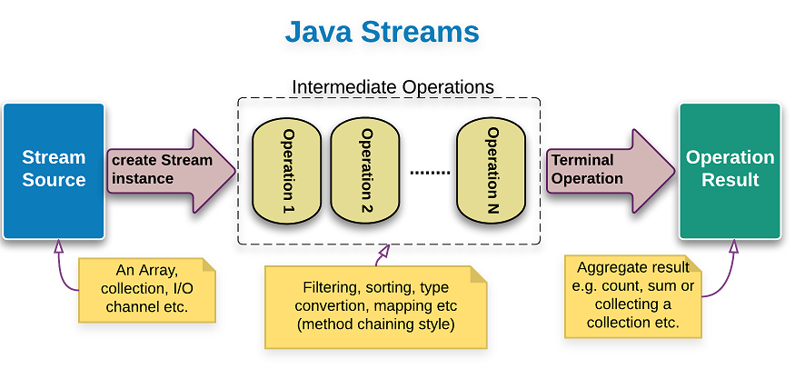
- **Intermediate operations**: Thực hiện các thao tác trung gian:  filter(), skip(), limit(), map(), sorted()
- **Terminal operation**: Thực hiện thao tác đầu cuối:  forEach(),  collect(), anyMatch(), allMatch(), noneMatch(), count(), min(), max(), summaryStatistics(), reduce()
- **Hạn chế**: không tái sử dụng được khi gọi teminal operation
### [5. Date Time](https://gpcoder.com/4062-date-time-trong-java-8/)

### [6. Collection API Enhencements](https://gpcoder.com/3919-phuong-thuc-foreach-trong-java-8/)

### [7. Optional](https://gpcoder.com/3945-optional-trong-java-8/)

## [JRE, JDK](https://codelearn.io/sharing/tim-hieu-ve-jre-trong-java)
## [JVM]()
## [MVN](https://niithanoi.edu.vn/trinh-bien-dich-java-hoat-dong-the-nao.html)
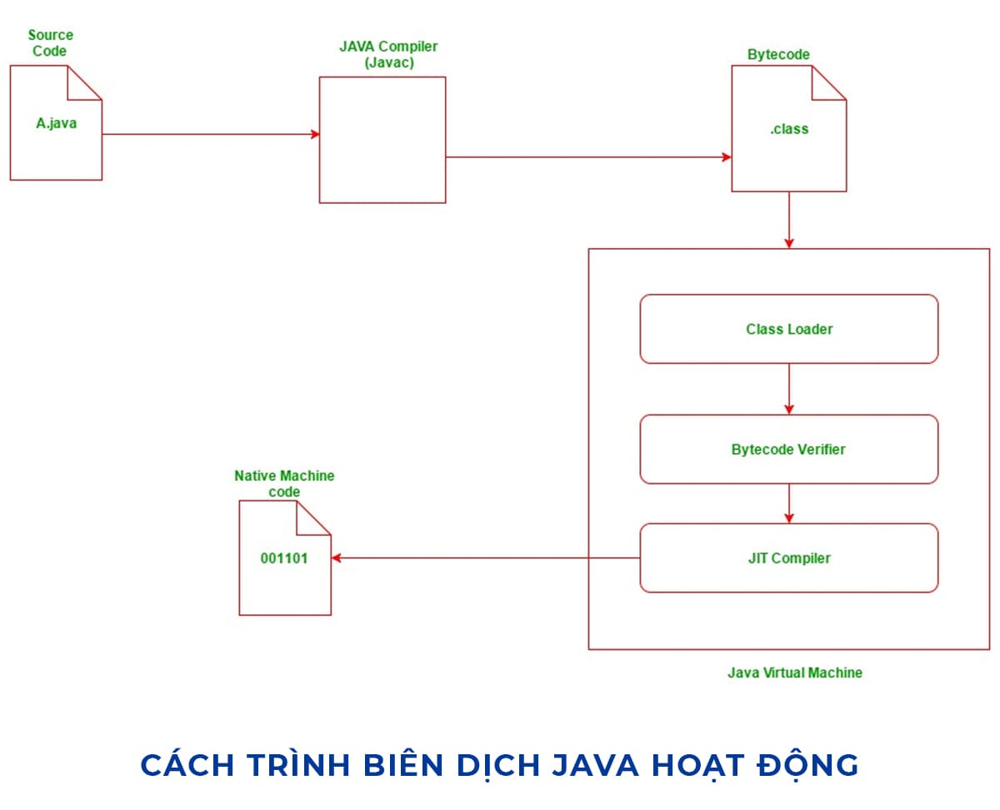
---
## **Java core**
## Collection
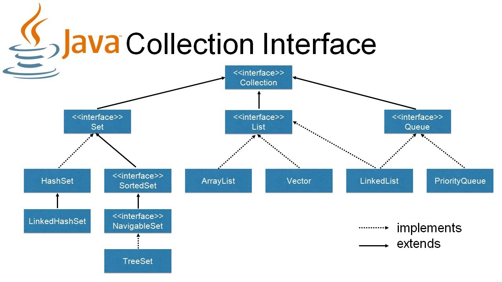
- **LinkedList**: là một class dạng list hoạt động trên cơ sở của cấu trúc dữ liệu danh sách liên kết đôi (double-linked list)
- **Vector**: khá là tương tự với ArrayList, tuy nhiên điểm khác biệt là Vector là synchronized, hay là đồng bộ, có thể hoạt động đa luồng mà không cần gọi synchronize một cách tường minh
- **PriorityQueue**: là 1 dạng queue mà trong đó các phần tử trong queue sẽ được sắp xếp.
- **ArrayDeque**: là 1 dạng deque (queue 2 chiều) được implement dựa trên mảng

### [1. ArrayList](https://www.youtube.com/watch?v=jSlmXcE7g7A)
 - ArrayList được tổ chúc là 1 mãng cách list object
 - Khi khởi tạo ArrayList có thể khở tạo 1 ArrayList rổng hay có thể truyền size cho nó
 - Khi add phần từ đầu tiên thì default size sẽ là 10, nếu add quá số lượng 10 thì kích thước ArrayList sẽ được tăng thêm 50% kích thước cũ
 - Khi remove 1 phần tử bất kì thì nó sẽ dùng hàm System.arraycopy đề di chuyển các phần tử phía sau lên 1 bật, nếu truyền vào đối tượng cụ thể thì nó sẽ tìm index nhỏ nhất để remove

### [2. Hashset](https://viettuts.vn/java-collection/hashset-trong-java-hoat-dong-nhu-the-nao)
- Bên dưới Hashset thực ra là 1 Hashmap
- Mỗi constructor bên trong HashSet tạo ra một đối tượng HashMap mới.
- Sử dụng phương thức add(), nó tạo ra một đối tượng Entry bên trong đối tượng HashMap, với phần tử đã chỉ định làm khóa và giá trị không đổi gọi là PRESENT

### [3. Hashsmap](https://viblo.asia/p/hashmap-trong-java-hoat-dong-nhu-the-nao-gDVK2M325Lj)
<!-- https://codeaholicguy.com/2015/12/13/series-java-nhung-dieu-co-the-ban-da-biet-maphashmap-hoat-dong-nhu-the-nao/ -->
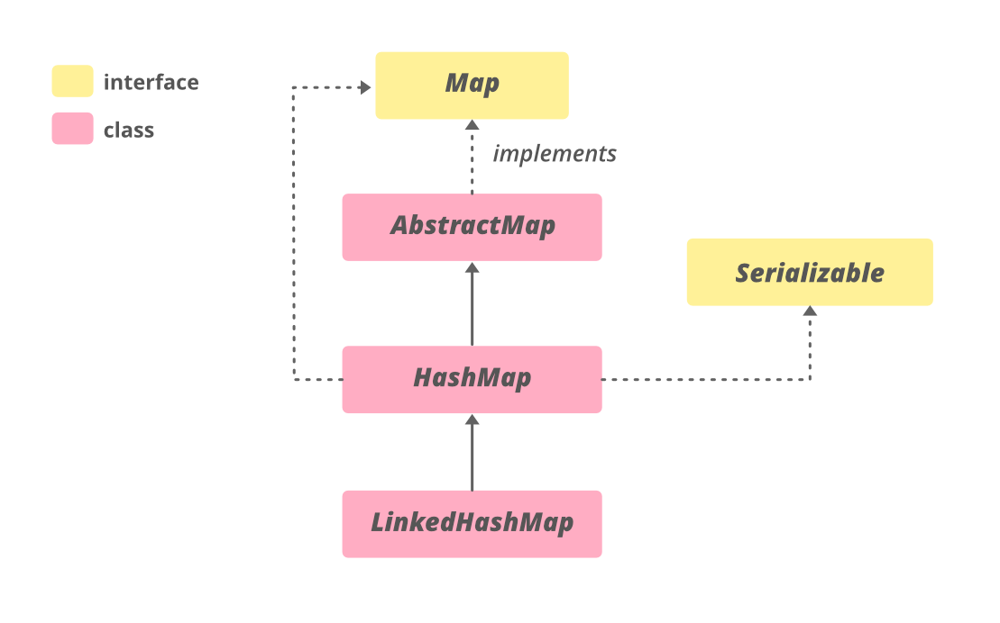
- Lưu data dưới dạng K V, hoạt động dựa trên nguyên tắt hashing (Hashing là chức năng hoặc thuật toán hoặc phương pháp mà khi áp dụng cho bất kỳ đối tượng / biến trả về một giá trị số nguyên duy nhất đại diện cho rằng đối tượng / biến)
- HashMap sử dụng phương thức hashCode và equals để thêm vào (put) và lấy lại (get) phần từ một tập hợp tương ứng. Khi hàm put() đuợc gọi, HashMap tính toán giá trị hashcủa khoá và lưu trữ cặp giá trị (key-value) đuợc đánh chỉ mục (index) thích hợp vào tập hợp. Nếu khoá đã tồn tại, giá trị của nó đuợc cập nhật bằng giá trị mới.
- Nếu 2 hàm này không đuợc cài đặt (implement) chính xác, như 2 khoá khác nhau lại cho ra hash code (giá trị đã băm) giống nhau và vì vậy chúng sẽ đuợc xem như là bằng nhau trong tập hợp. Hai hàm này còn sử dụng để phát hiện trùng lặp. Nên việc cài đặt 2 hàm là yếu tốt then chốt để kiểm tra tính đúng đắn của HashMap
- tính toán hashcode dựa vào key -> tính toán index (indexfor) -> kiểm tra các key tại index nếu trùng thay thế giá tri mới, không trùng nối thêm vào sau
- LinkedHashMap giúp như map chỉ khác nó được sắp xếp theo tứ tự thêm vào, Khi remove thì gọi hàm removeEntryForKey của hashmap

### [4. Iterator](https://codegym.vn/blog/2020/04/29/huong-dan-su-dung-iterator-trong-java/)
 - Iterator ra đời để thay thế cho Enumerations  dùng duyệt các phần từ cở collection (Collection kế thừa từ interface Iterable)
 - hasNext(), next(), remove(), forEachRemaining()
---
## [OOP]()
- Tính trừu tượng (abstraction): Tạo ra các lớp trừu tượng mô hình hoá các đối tượng trong thế giới thực.
- Tính đóng gói (Encapsulation): Các thực thể của lớp trừu tượng có các giá trị thuộc tính riêng biệt.
- Tính kế thừa (Inheritance): Các đối tượng có thể dễ dàng kế thừa và mở rộng lẫn nhau.
- Tính đa hình (Polymorphism): Có thể thực hiện một hành động đơn theo nhiều cách thức khác nhau tuỳ theo loại đối tượng cụ thể đang được gọi.
## [SOLID](https://toidicodedao.com/2015/03/24/solid-la-gi-ap-dung-cac-nguyen-ly-solid-de-tro-thanh-lap-trinh-vien-code-cung/)

- **Single responsibility priciple (SRP)**: Một class chỉ nên giữ 1 trách nhiệm duy nhất 
(Chỉ có thể sửa đổi class với 1 lý do duy nhất)
- **Open/closed principle**: Có thể thoải mái mở rộng 1 class, nhưng không được sửa đổi bên trong class đó (open for extension but closed for modification).
- **Liskov Substitution Principle**: Trong một chương trình, các object của class con có thể thay thế class cha mà không làm thay đổi tính đúng đắn của chương trình
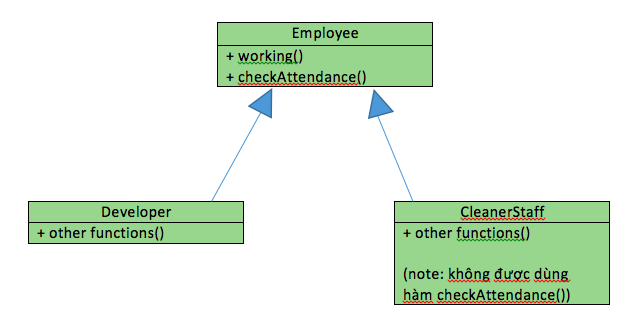
- **Interface segregation principle**: Thay vì dùng 1 interface lớn, ta nên tách thành nhiều interface nhỏ, với nhiều mục đích cụ thể.
- **Dependency inversion principle**: Các module cấp cao không nên phụ thuộc vào các modules cấp thấp. Cả 2 nên phụ thuộc vào abstraction. Interface (abstraction) không nên phụ thuộc vào chi tiết, mà ngược lại (Các class giao tiếp với nhau thông qua interface (abstraction), không phải thông qua implementation.)
---
## [Composition over Inheritance](https://www.geeksforgeeks.org/favoring-composition-over-inheritance-in-java-with-examples/#:~:text=Favoring%20Composition%20over%20Inheritance%20is,a%20base%20or%20parent%20class.&text=Inheritance%20should%20only%20be%20used%20when%20subclass%20'is%20a'%20superclass.)
- Inheritance: is a
- Composition: has a, uses a
- Why Inheritance over Composition: 
``` java
public interface Runner {
    public void run(int speed);
}

public class FourLegRunner implements Runner {
    public void run(int speed) {
        system.out.println("running with 4 legs and " + speed + "mph");
    }
}

public class Dog extends Animal {

    private Runner runner;

    public Dog(int speed, Runner runner) {
        super("Wuff", speed);
        this.runner = runner;
    }

    public void run() {
        this.runner.run(speed);
    }
}
```
<!-- https://medium.com/applike/how-to-using-composition-over-inheritance-6681ed1b78e4 -->

## [Race Conditions trong Critical Sections](https://viblo.asia/p/multithreading-race-conditions-critical-sections-va-thread-safety-OEqGj6LlG9bL)
- Khi 2 hay nhiều threads cùng sử dụng chung một resource, khi mà thứ tự thao tác với resource có ý nghĩa quan trọng được gọi là race conditions. Đoạn code dẫn tới race conditions được gọi là critical sections. dùng *synchronized*  để giải quyết

---
## [Design patten](https://gpcoder.com/4164-gioi-thieu-design-patterns/)
- `Creational Pattern (nhóm khởi tạo – 5 mẫu) gồm`: Factory Method, Abstract Factory, Builder, Prototype, Singleton. Những Design pattern loại này cung cấp một giải pháp để tạo ra các object và che giấu được logic của việc tạo ra nó, thay vì tạo ra object một cách trực tiếp bằng cách sử dụng method new. Điều này giúp cho chương trình trở nên mềm dẻo hơn trong việc quyết định object nào cần được tạo ra trong những tình huống được đưa ra.
- `Structural Pattern (nhóm cấu trúc – 7 mẫu) gồm`: Adapter, Bridge, Composite, Decorator, Facade, Flyweight và Proxy. Những Design pattern loại này liên quan tới class và các thành phần của object. Nó dùng để thiết lập, định nghĩa quan hệ giữa các đối tượng.
- `Behavioral Pattern (nhóm tương tác/ hành vi – 11 mẫu) gồm`: Interpreter, Template Method, Chain of Responsibility, Command, Iterator, Mediator, Memento, Observer, State, Strategy và Visitor. Nhóm này dùng trong thực hiện các hành vi của đối tượng, sự giao tiếp giữa các object với nhau.
### [Singleton ](https://niithanoi.edu.vn/singleton-trong-java.html#:~:text=Singleton%20trong%20Java%20l%C3%A0%20g%C3%AC,m%E1%BB%8Di%20n%C6%A1i%20trong%20ch%C6%B0%C6%A1ng%20tr%C3%ACnh.)
- Eager initialization: nhược điểm là thể hiện đó được tạo ra mặc dù ứng dụng khách có thể không sử dụng nó.
```java
public class EagerInitialization {

    private static final EagerInitialization instance = new EagerInitialization();
    // hàm constructor để tránh các client-application sử dụng
    private EagerInitialization() {
    }
    public static EagerInitialization getInstance() {
        return instance;
    }
}
```
- Static block initialization: tương tự như Eager initialization, ngoại trừ trường hợp lớp được tạo trong khối static cung cấp tùy chọn để xử lý ngoại lệ.
```java
public class StaticBlock {
    private static StaticBlock instance;
    private StaticBlock() {
    }
    // tạo khối static để xử lý ngoai lệ
    static {
        try {
            instance = new StaticBlock();
        } catch (Exception e) {
            throw new RuntimeException("Có ngoại lệ xảy ra");
        }
    }
    public static StaticBlock getInstance() {
        return instance;
    }
}
```
- Lazy Initialization: hoạt động tốt trong trường hợp môi trường đơn luồng nhưng khi đối với các hệ thống đa luồng, nó có thể gây ra sự cố 
```java
public class LazyInitialization {

    private static LazyInitialization instance;
    private LazyInitialization() {
    }
    public static LazyInitialization getInstance() {
        if (instance == null) {
            instance = new LazyInitialization();
        }
        return instance;
    }
}
```
- Thread Safe Singleton
```java
private static ThreadSafe instance;
    private ThreadSafe() {
    }
    public static synchronized ThreadSafe getInstance() {
        if (instance == null) {
            instance = new ThreadSafe();
        }
        return instance;
    }
```
- Bill Pugh Singleton: Đây là cách tiếp cận được sử dụng rộng rãi nhất cho lớp Singleton vì nó không yêu cầu đồng bộ hóa
```java
public class BillPugh {

    private BillPugh() {
    }
    private static class SingletonHelper {
        private static final BillPugh INSTANCE = new BillPugh();
    }
    public static BillPugh getInstance() {
        return SingletonHelper.INSTANCE;
    }
}
```
=> có thể dùng Reflection để phá hủy mô hình Singleton

### [Factory Method Pattern](https://gpcoder.com/4352-huong-dan-java-design-pattern-factory-method/#:~:text=Factory%20Method%20Design%20Pattern%20hay,m%E1%BB%99t%20c%C3%A1ch%20linh%20ho%E1%BA%A1t%20h%C6%A1n.)

- Factory Pattern đúng nghĩa là một nhà máy, và nhà máy này sẽ “sản xuất” các đối tượng theo yêu cầu của chúng ta.

- Trong Factory Pattern, chúng ta tạo đối tượng mà không để lộ logic tạo đối tượng ở phía người dùng và tham chiếu đến đối tượng mới được tạo ra bằng cách sử dụng một interface chung.

- Factory Pattern được sử dụng khi có một class cha (super-class) với nhiều class con (sub-class), dựa trên đầu vào và phải trả về 1 trong những class con đó.
- Lợi ích: Factory Pattern giúp giảm sự phụ thuộc giữa các module, Mở rộng code dễ dàng hơn, Khởi tạo các Objects mà che giấu đi xử lí logic của việc khởi tạo đấy, Thống nhất về naming convention: giúp cho các developer có thể hiểu về cấu trúc source code.
### [Abstract Factory Pattern](https://gpcoder.com/4365-huong-dan-java-design-pattern-abstract-factory/)

-  Abstract factory như là một nhà máy lớn chứa nhiều nhà máy nhỏ, trong các nhà máy đó có những xưởng sản xuất, các xưởng đó tạo ra những sản phẩm khác nhau

---
# Spring boot
## [Spring application]()
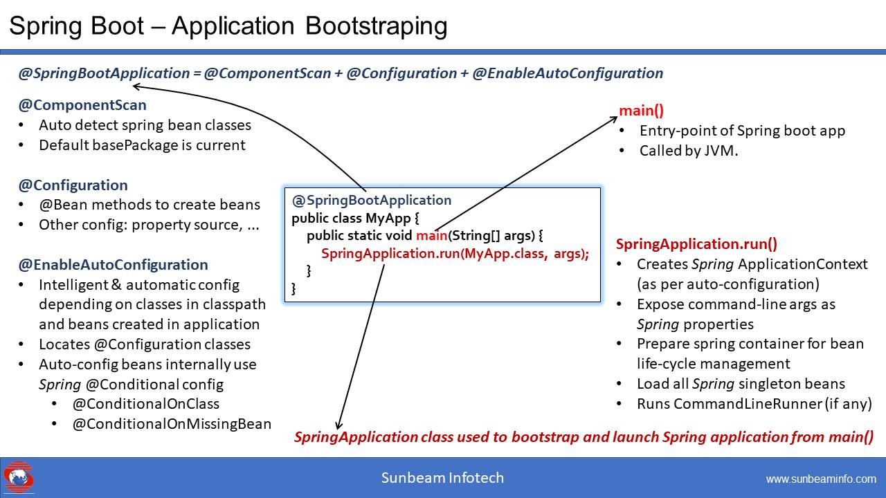

### [DI](https://viblo.asia/p/dependency-injection-ap-dung-vao-spring-boot-nhu-the-nao-phan-2-3P0lP1wG5ox)
- DI principle: Các module cấp cao không nên phụ thuộc (trực tiếp) vào module cấp thấp. Cả hai nên phụ thuộc vào abstraction (của OOP).Abstraction không nên phụ thuộc vào chi tiết, mà ngược lại.
- IoC: có các thành phần có sẵn làm nhiệm vụ tạo, quản lý các đối tượng trong chương trình. IoC sẽ quản lý, phân tích các mối phụ thuộc, tạo các đối tượng theo thứ tự phù hợp nhất và liên kết chúng lại với nhau, ServiceLocator, Delegate, DI
- DI: là một dạng thực hiện của IoC, bằng cách tiêm (inject) module vào một module khác cần nó. Nếu khi tạo module nào đó, mà module đó cần một module khác phụ thuộc, thì IoC sẽ tìm trong IoC container xem có không, nếu có thì inject vào, nếu chưa thì tạo mới, bỏ vào container và inject vào. Việc inject tự động các dependency (module) như thế được gọi là Dependency injection.
   * **Constructor-based injection**: Dùng inject các module bắt buộc. Các module được inject nằm trong constructor, và được gán lần lượt vào các field.
   * **Setter-based injection**: Dùng inject các module tùy chọn. Mỗi module sẽ được inject thông qua setter, nằm ở tham số và cũng gán cho field nào đó.

### [Application Context]()
### [Spring auto config]()
### [Spring security]()
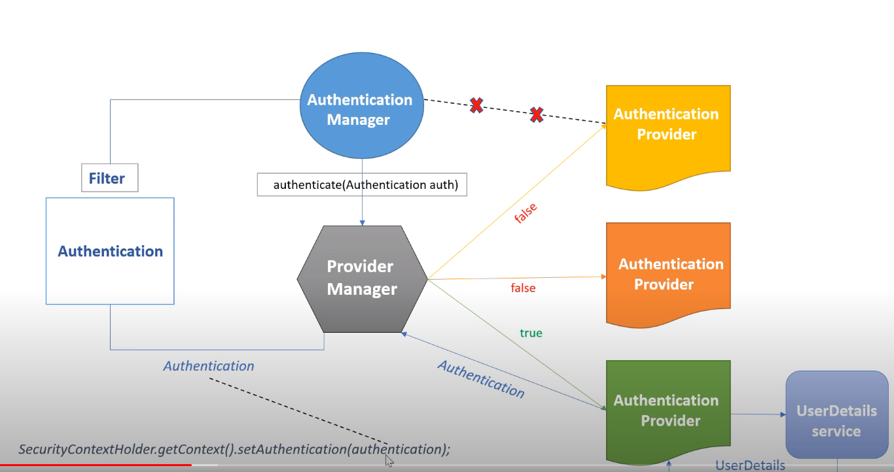

## [Srping bean](https://www.baeldung.com/spring-bean-scopes)
- singleton
- prototype
- request
- session
- application
- websocket
(request, session, application and websocket, are only available in a web-aware application.)

## [OAuth2](https://viblo.asia/p/tim-hieu-doi-chut-ve-oauth2-eW65GvMLlDO)
- Authorization Code
- Resource Owner Password Credentials
- Implicit
- Client Credentials

## [Liquibase]()

---
# [Kafka](https://kipalog.com/posts/Series-Tim-Hieu-Apache-Kafka--phan-1)
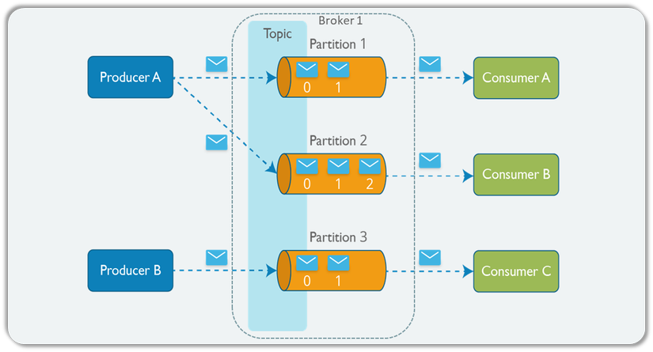
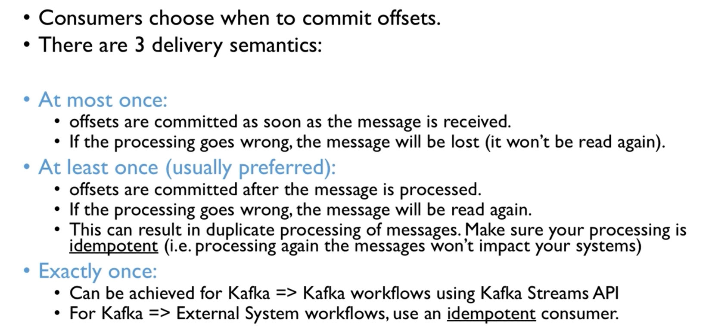

## [ACID]()
ACID (viết tắt của Atomicity, Consistency, Isolation, Durability) là một khái niệm cơ sở dữ liệu mà các chuyên gia thường tìm kiếm khi đánh giá các cơ sở dữ liệu và kiến trúc ứng dụng. Đối với một cơ sở dữ liệu đáng tin cậy tất cả bốn thuộc tính cần đạt được.

- `Atomicity` tính “nguyên tử” của giao dịch. Nghĩa là mọi giao dịch chỉ thành công khi tất cả các phần thành công All or Nothings.
- `Consistency` tính nhất quán. Nghĩa là mọi dữ liệu được thao tác đều nhất quán với tất cả các quy tắc (rules), các rằng buộc (constraint)... trong toàn bộ quá trình xử lý từ khi bắt đầu tới khi kết thúc.
- `Isolation`  tính cô lập. Nó đảm bảo việc thực thi đồng thời của các giao dịch chỉ có thể có kết quả khi các giao dịch được thực hiện tuần tự
- `Durability` tính bền. Nghĩa là mọi giao dịch khi commit thì kết quả nó phải được đảm bảo, cho dù ứng dụng bị tắt, mất điện server

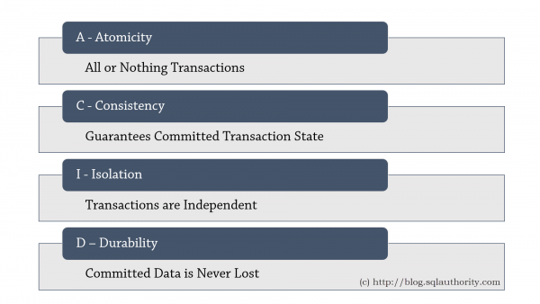

## [No SQL](https://toidicodedao.com/2015/09/29/nosql-co-gi-hay-ho-tong-quan-ve-nosql-phan-2/)
<!-- https://blog.kdata.vn/so-sanh-sql-va-nosql-hai-loai-hinh-co-so-du-lieu-pho-bien-nhat-262/ -->

- Dữ liệu trong NoSQL DB được lưu dưới dạng document, object. Truy vấn dễ dàng và nhanh hơn RDBMS nhiều.
- NoSQL có thể làm việc hoàn toàn ok với dữ liệu dạng không có cấu trúc.
- Việc đổi cấu trúc dữ liệu (Thêm, xóa trường hoặc bảng) rất dễ dàng và nhanh gọn trong NoSQL.
- Vì không đặt nặng tính ACID của transactions và tính nhất quán của dữ liệu, NoSQL DB có thể mở rộng, chạy trên nhiều máy một cách dễ dàng.

   * **Key-Value Database**: Redis, MemCache
   * **Document Database**: MongoDB, RavenDB
   * **Column-Family Database**: Cassandra 
   * **Graph Database**: Neo4j, InfiniteGraph, OrientDB


# [Microservice](https://itnavi.com.vn/blog/microservices-la-gi/)
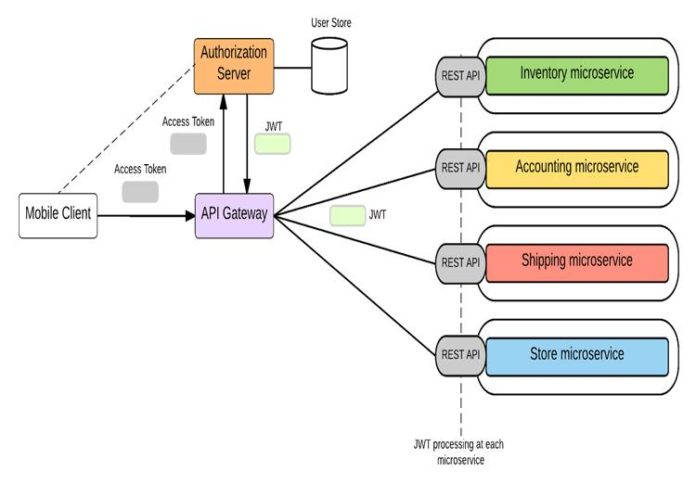
<!-- https://viblo.asia/p/tim-hieu-ve-microservices-phan-3-quan-ly-co-so-du-lieu-tren-microservices-vyDZO0G9lwj -->
- Lợi ích của microservice:
   * Source code rất tinh gọn
   * Bảo mật tối ưu cho source code
   * Được tồn tại độc lập
   * Scale hoàn toàn độc lập

- Share Database (Hạn chế)
   * **Development time coupling**: Sự thay đổi schema của DB sẽ gây ảnh hưởng đến nhiều services do chúng truy cập trực tiếp vào các tables
   * **Runtime coupling**: ất cả các services truy cập vào cùng một cơ sở dữ liệu, chúng có khả năng can thiệp lẫn nhau
   * DB đơn lẻ không thể đáp ứng đủ yêu cầu về lưu trữ và truy cập dữ liệu của tất cả các services
- Database per service
   * Việc thực hiện các transaction trải rộng trên nhiều serivces không đơn giản
   * Việc thực hiện các queries cần join data có trong nhiều cơ sở dữ liệu là một thách thức
   * Sự phức tạp của việc quản lý nhiều cơ sở dữ liệu SQL và NoSQL

## [Two Phase Commit](https://m.facebook.com/nt/screen/?params=%7B%22note_id%22%3A646791706259335%7D&path=%2Fnotes%2Fnote%2F&_rdr)
Two phase commit là giải pháp duy nhất đảm bảo các tính chất ACID của distributed transaction. Như tên gọi, quá trình thực thi giao dịch sẽ chia làm hai giai đoạn:
- Giai đoạn một, Request Commit Phase: giai đoạn này từ client sẽ gửi lệnh ghi tới các resources. Đồng thời ghi client sẽ ghi log Undo và Redo.
- Giai đoạn hai, Commint Phase: sau khi nhận được từ response ghi thành công từ tất cả các resources, thì từ client gửi lệnh Commit tới tất cả resources. 
- Nếu có bất cứ request nào thực thi bị lỗi thì sẽ tiến hành gửi lệnh undo tới tất cả các resources
## [Saga pattern](https://viblo.asia/p/tim-hieu-ve-microservices-phan-3-quan-ly-co-so-du-lieu-tren-microservices-vyDZO0G9lwj)

### `Events/Choreography-based saga`
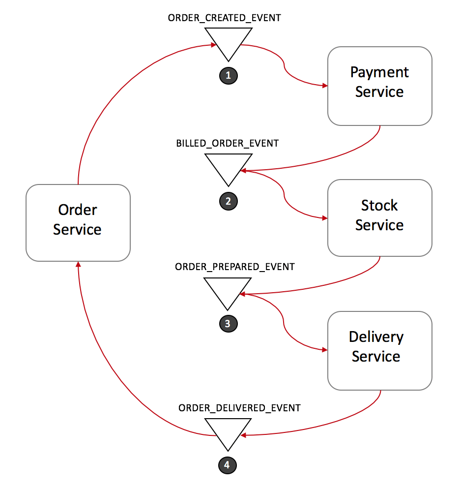

### `Command/Orchestration`
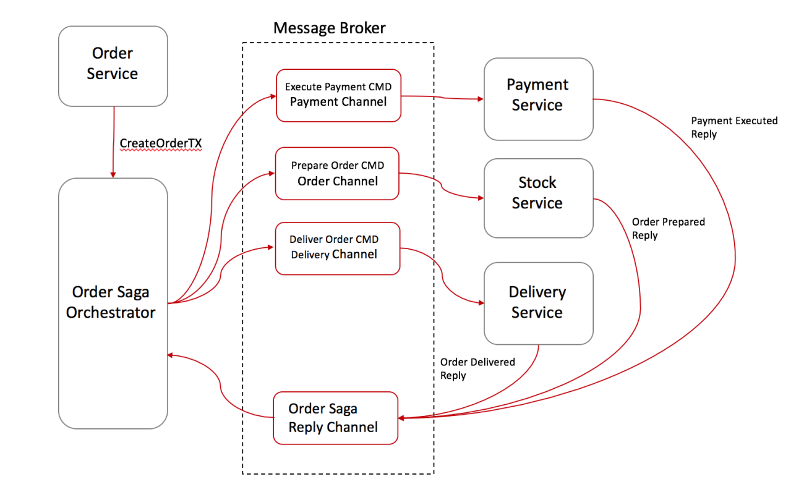

# [Có một vài kiểu mẫu xử lý lỗi trong microservices phổ biến](https://viblo.asia/p/microservices-cuoi-ngua-xem-hoa-bJzKm7wPl9N)
 - Circuit Breaker: Khi có lời gọi từ bên ngoài đến một microservice, bạn có thể cấu hình một component giám sát lỗi với mỗi lời gọi. Component này đếm số yêu cầu thành công và thất bại, khi lỗi đạt một giới hạn nhất định thì component này sẽ dừng hoạt động của service (ngắt giao mạch).
 Cách này hữu dụng để tránh tiêu tốn tài nguyên không cần thiết, yêu cầu bị chậm vì timeouts, cách này cũng giúp giám sát hệ thống.
 - Bulkhead: một service dừng hoạt động không nên ảnh hưởng đến phần còn lại. Kiểu mẫu bulkhead tách biệt các phần của ứng dụng để khi có lỗi tại một nơi nào đó thì không ảnh hưởng hệ thống.
 - Timeout:  một quy trình cho phép dừng một yêu cầu khi thời gian chờ đợi vượt quá hạn mức

# [Spring WebFlux](https://kipalog.com/posts/Spring-Boot---Xa-y-du--ng-u--ng-du-ng-Reactive-vo--i-Spring-5-Webflux)
Spring Webflux là một phiên bản song song với Spring MVC và hỗ trợ non-blocking reactive streams. Nó hỗ trợ khái niệm back pressure và sử dụng Server Netty để run hệ thống reactive.
- Mono: Phát ra 0 hoặc 1 phần tử.

- Flux : Phát ra 0..N phần tử.

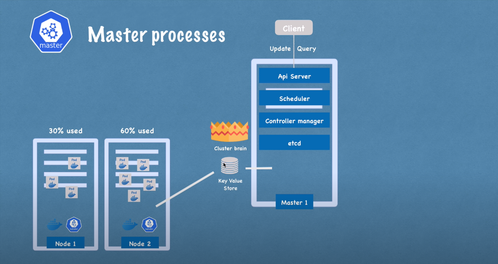
